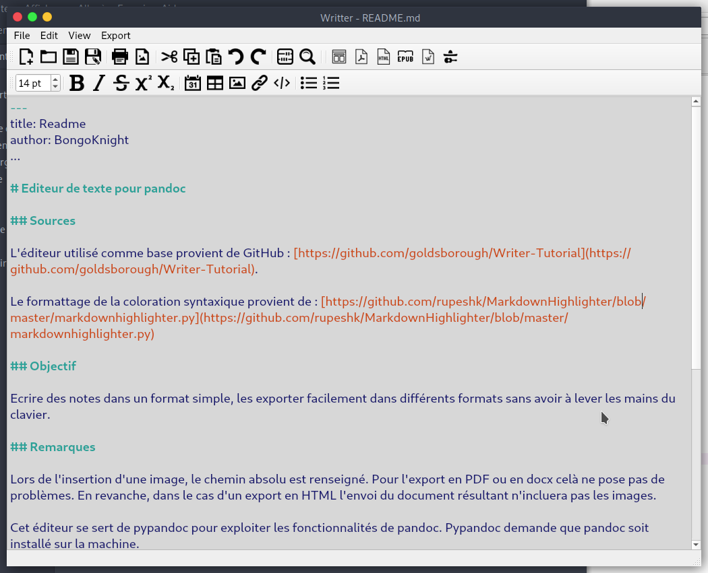

---
title: Readme
author: BongoKnight
toc-title: Sommaire
...

# Editeur de texte pour pandoc

## Screenshot



## Utilisation

### Utilisation basique

Le markdown est un format de balissage léger. Cet éditeur permet de simplifier la mise en forme du texte avec ce balisage. En particulier, l'insertion de liens, de tableaux, d'images est simplifiée.

Il est ensuite possible de configurer des options d'exports comme :
- une feuille de style CSS,
- un template,
- faire apparaitre une table des matières dans le document etc...

Voici quelques exemples :

1. Une
2. liste
3. numérotée

Du texte en **gras** ou en *italique*, on peut aussi écrire H~2~O ou 2^10^. Enfin pour les écritures mathématiques le mieux reste d'utiliser le format Latex (qui fait aussi partie des améliorations à venir)...

Ici un lien vers une image de [puma](https://en.wikipedia.org/wiki/Puma_(genus)#/media/File:CMM_MountainLion.jpg)

Et ici l'image :

#/media/File:CMM_MountainLion.jpg)


Ou ici redimensionnée en tout petit :
#/media/File:CMM_MountainLion.jpg){ width=2cm }


Et ici un tableau (qui n'apparait pas bien sur github mais qui sera tout beau dans vos documents):

Ville | Precipitations
------|---------------
Nice  | 600 mm/an     
Brest | 1200 mm/an    

Des lignes de séparations :

_____________________________

----------------------------

Des notes de bas de pages : comme ici [^unenote]

[^unenote]: qui apparaitra à la fin de la page.


[Des petites lettres majuscules!]{.smallcaps}

[Un peu de mise en forme, du texte rouge]{textcolor:red}

```python
def sum(a,b):
	return a+b
```

Certains caractères doivent être échappés avec un \ selon le contexte :
```bash
Mais pas dans les blocs de code!
\`*_{}[]()>#+-.!
```

> De la manière suivante il est possible de mettre du texte en avant. Certains mots dans le texte peuvent aussi `être mis en évidence de cette façon`!

### Quelques conseils

Pour faire des rapports en `docx` ou en `pdf`, il est conseiller de modifier le template de base de pandoc pour en faire un correspondant à vos attentes. Dans le dossier `ìnput` des templates basiques pour les différents formats devraient arriver bientôt.


## Objectif

Ecrire des notes dans un format simple, les exporter facilement dans différents formats sans avoir à lever les mains du clavier.

## Remarques

Lors de l'insertion d'une image, le chemin absolu est renseigné. Pour l'export en PDF ou en docx celà ne pose pas de problèmes. En revanche, dans le cas d'un export en HTML l'envoi du document résultant n'incluera pas les images.

Cet éditeur se sert de pypandoc pour exploiter les fonctionnalités de pandoc. Pypandoc demande que pandoc soit installé sur la machine.

De la même manière pour pouvoir générer des PDF, pandoc a besoin d'une installation de Latex.

## Améliorations

- [x] Export dans différents formats : HTML, PDF, Tex, docx
- [x] Export avec possibilité de définir un template
- [x] Supporter l'insertion de tableau au format pipe_table de pandoc
- [x] Réouverture du dernier fichier ouvert ( => fichier de config)
- [x] Possibilité de choisir un fichier CSS, inclure par défaut du  CSS comme GitHub pour l'export HTML.
- [ ] Faire un exécutable avec PyInstaller
- [ ] Refactoring pour réduire la taille de la classe TextEdit
- [ ] Modifier légèrement les couleurs de la coloration syntaxique
- [ ] Plusieurs onglets d'éditions
- [x] Prévisualisation dans une WebView (Ctrl+Shift+P) //TODO Séparation droite gauche
- [ ] Correction orthographique
- [x] Sélection d'arguments lors de l'export : --standalone-file, --toc ...
- [ ] Guide d'installation et d'édition
- [ ] Ajouter des templates de base pour l'export HTML, PDF et docx.

## Sources

L'éditeur utilisé comme base provient de GitHub : [https://github.com/goldsborough/Writer-Tutorial](https://github.com/goldsborough/Writer-Tutorial).

Le formattage de la coloration syntaxique provient de : [https://github.com/rupeshk/MarkdownHighlighter/blob/master/markdownhighlighter.py](https://github.com/rupeshk/MarkdownHighlighter/blob/master/markdownhighlighter.py)

Le CSS d'export en HTML vient de [https://gist.github.com/dashed/6714393](https://gist.github.com/dashed/6714393).

La config provient de : [https://stackoverflow.com/questions/47561835/best-practice-for-keeping-a-config-file-in-python](https://stackoverflow.com/questions/47561835/best-practice-for-keeping-a-config-file-in-python)
